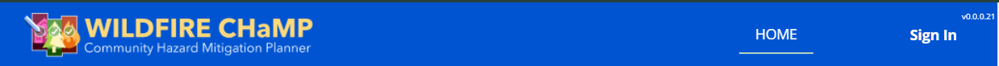

# Shared React AppBar

This module provides a very specification implementation of MUI's AppBar component.
Assumes you have the following:
`@timmons-group/shared-react-permission-filter`
`@timmons-group/shared-react-auth`

Recommended:
`@timmons-group/shared-auth-config`

It includes / requires authentication and authorization within an application via ProvidAuth and useAuth and must be inside a react-dom-router context.

## Pics, it did happen! ##
In these images there is a version number visible that is not part of this library and would be up to you to render as needed.
### Anonymous ###
At full width:


Mobile
A hamburger icon will be shown via `mobileWidth` with a media query:


### Signed In ###
At full width:


A profile icon will be shown via `mobileUserWidth` with a media query:


A hamburger icon will be shown via `mobileWidth` with a media query:


## Installation

`npm i -S @timmons-group/shared-react-app-bar`

## Usage
Getting AppBar in place is essentially bootstrapping your entire application.

In your App.jsx

```javascript
import "@styles/app.scss";

// Third-party imports
import axios from "axios";
import { useEffect, useState } from "react";
import { HashRouter as Router } from "react-router-dom";
import ThemeProvider from "@mui/material/styles/ThemeProvider";
import CssBaseline from "@mui/material/CssBaseline";
import { ProvideAuth } from "@timmons-group/shared-react-auth";
import { getConfigBuilder } from "@timmons-group/shared-auth-config";

import AppRoutes from "./AppRoutes";
//Some muiTheme
import theme from "./muiTheme";

const App = () => {
  const [initialized, setInitialized] = useState(false);
  const [config, setConfig] = useState(null);

  // fetch a config with useEffect
  useEffect(() => {
    if (!initialized) {
      axios.get(`/api/oauth/config`)
        .then((res) => {
          // You do not HAVE to use config builder to create your object, it is HIGHLY recommended
          const cfg = getConfigBuilder()
            .withRawConfiguration(res.data)
            .withAppAuthorization("LCWPP")
            .build();
          setConfig(cfg);
          setInitialized(true);
        })
        .catch((_err) => {
          setConfig({ error: "Config not found" });
          setInitialized(true);
        });
    }
    // eslint-disable-next-line react-hooks/exhaustive-deps
  }, []);

  if (config) {
    // Add context Auth provider to the App
    return (
      <>
        <ProvideAuth config={config} state={{ redirect: "/lcwpp/" }}>
          <ThemeAndRoutes />
        </ProvideAuth>
      </>
    );
  } else {
    return (
      <div>
          Loading...
          <br />
          This is our application
      </div>
    );
  }
}

const ThemeAndRoutes = () => {
  return (
    // MUI Theme Provider
    <ThemeProvider theme={theme}>
      {/* CssBaseline global cssReset or css normalize functionality */}
      <CssBaseline />
        {/* React DOM Router */}
        <Router>
          {/* Our actual application, You probably will need many more contexts for react-query or MUI datepickers nest as you see fit */}
          <AppRoutes />
        </Router>
    </ThemeProvider>
  );
};

export default App;
```

AppRoutes.jsx
```javascript
import { Route, Routes } from 'react-router-dom';
import { useAuth, AUTH_STATES } from '@timmons-group/shared-react-auth';
import { ContainerWithCard } from '@timmons-group/shared-react-components';
import PermissionFilter from '@timmons-group/shared-react-permission-filter';

// Local imports
import Layout from './Layout';
import Home from '@pages/Home';
import SomePageComponent from '@pages/SomePageComponent';
import MainLanding from '@pages/Landing/MainLanding';

// Create a generic not found component
const NotFound = () => {
  return (
    <ContainerWithCard>
      <p>Not Found</p>
    </ContainerWithCard>
  );
};

const AppRoutes = () => {
  const { authState } = useAuth();
  const loginStatus = authState?.state;

  if (
    loginStatus === AUTH_STATES.INITIALIZING || loginStatus === AUTH_STATES.LOGGING_IN ||
    loginStatus === AUTH_STATES.ERROR || loginStatus === AUTH_STATES.LOGGED_OUT
  ) {
    return (<PublicRoutes />);
  } else if (loginStatus === AUTH_STATES.LOGGED_IN || loginStatus === AUTH_STATES.TOKEN_STALE || loginStatus === AUTH_STATES.REFRESHING_TOKEN) {
    return (<PrivateRoutes />);
  }

  return (<p>Error: {loginStatus} is an invalid state</p>)
};

const PublicRoutes: FC = () => {
  return (
    <Routes>
      <Route path="/" element={<Layout />}>
        <Route index element={<Home />} />
        <Route path="*" element={<NotFound />} />
      </Route>
    </Routes>
  )
}

const PrivateRoutes: FC = () => {
  return (
    <Routes>
      <Route path="/" element={<Layout />}>
        <Route path="/" element={<MainLanding />} />
        <Route path={`/myRoute/:id/*`} element={
          <PermissionFilter permission={"Can see my Page"}>
            <SomePageComponent />
          </PermissionFilter>
        } />
        <Route path="*" element={<NotFound />} />
      </Route>
    </Routes>
  );
}

export default AppRoutes;
```

And FINALLY in a Layout.jsx type file

```javascript
import { Outlet } from "react-router-dom";
import { useEffect, useState } from "react";

import { AUTH_STATES, useAuth } from "@timmons-group/shared-react-auth";

import AppBar from "@timmons-group/shared-react-app-bar";
import OurLogo from "./assets/logo.png";

....

const { login, logout, refresh, authState } = useAuth();
const navLinks = [
  { title: "Home", href: "/" },
  {
    title: "Dashboard",
    href: "/dashboard",
    permission: "Can see dashboard",
  }
];

return (
<>
<AppBar
        navLinks={navLinks}
        mobileWidth={700}
        onLogin={() => login(`appAfter=lcwpp`)}
        onLogout={() => logout()}
        logoUrl={OurLogo}
        showLoggingIn={authState?.state === AUTH_STATES.LOGGING_IN}
        userLinks={
          [
            {
              title: "Profile",
              href: '/profile',
            },
          ]
        }
      />
      <Outlet />
</>
)
```

## Props ##

| Name                    | Type               | Description                                                                                       | Default Value                                                                                     | Required |
|-------------------------|--------------------|---------------------------------------------------------------------------------------------------|---------------------------------------------------------------------------------------------------|----------|
| `navLinks`              | `AppBarNavLink[]`  | An array of navigation links to be displayed in the app bar.                                       | `[ { title: 'Home', href: '/' } ]`                                                                | No       |
| `buttonVariant`         | `string`           | The MUI variant name for the buttons created by `navLinks`.                                        | `'appbar'`                                                                                        | No       |
| `mobileButtonVariant`   | `string`           | The MUI variant name for mobile buttons.                                                           | `'appbarMobile'`                                                                                  | No       |
| `mobileWidth`           | `number`           | The width at which the mobile logic kicks in.                                                      | `950`                                                                                             | No       |
| `buttonClass`           | `string`           | CSS class name for the buttons.                                                                    | `'appbarButton'`                                                                                  | No       |
| `buttonClassMobile`     | `string`           | CSS class name for the mobile buttons.                                                             | `'appbarButtonMobile'`                                                                            | No       |
| `id`                    | `string`           | The ID of the app bar.                                                                             | `'main-app-bar'`                                                                                  | No       |
| `logoUrl`               | `string`           | The URL of the logo to be displayed in the app bar.                                                | `'https://wilcity.com/wp-content/uploads/2018/12/sample-logo-design-png-3-2.png'`                 | No       |
| `renderLogo`            | `function`         | A function to render a custom logo.                                                                | `undefined`                                                                                       | No       |
| `themeGroup`            | `object`           | The theme settings for the app bar.                                                                | `undefined`                                                                                       | No       |
| `logoText`              | `string`           | Text to be displayed alongside the logo.                                                           | `undefined`                                                                                       | No       |
| `renderUserMobileMenuIcon` | `function`      | A function to render a custom user mobile menu icon.                                               | `undefined`                                                                                       | No       |
| `renderUserMenu`        | `function`         | A function to render a custom user menu.                                                           | `undefined`                                                                                       | No       |
| `onLogin`               | `function`         | A function to handle login actions.                                                                | `undefined`                                                                                       | No       |
| `onLogout`              | `function`         | A function to handle logout actions.                                                               | `undefined`                                                                                       | No       |
| `userLinks`             | `array`            | An array of user links to be displayed in the user menu.                                           | `undefined`                                                                                       | No       |
| `showLoggingIn`         | `boolean`          | A flag to show the logging in state.                                                               | `undefined`                                                                                       | No       |
| `mobileUserWidth`       | `number`           | The width at which the user menu switches to mobile mode.                                          | `1000`                                                                                            | No       |
| `loginLabel`            | `string`           | The label for the login button.                                                                    | `'Sign In'`                                                                                       | No       |
| `logoutLabel`           | `string`           | The label for the logout button.                                                                   | `'Sign Out'`                                                                                      | No       |
